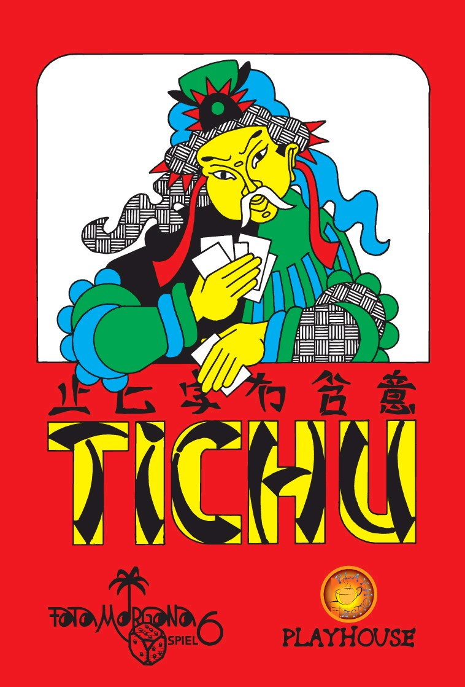

# Tichu - Team SALT´D

This is a simple C++ implementation of the game "Tichu". The official game is published by Fata Morgana, you can find the official [German rules here](https://abacusspiele.de/wp-content/uploads/2021/01/Tichu_Regel.pdf) and the [English ones here](https://fatamorgana.ch/fatamorgana/tichu/english-rules).
The implementation features a client/server architecture for multiplayer scenarios.
It uses [Dear ImGui](https://github.com/ocornut/imgui) for the GUI, [sockpp](https://github.com/fpagliughi/sockpp) for the network interface, [nlohmann/json](https://github.com/nlohmann/json) for object serialization, and [googletest](https://github.com/google/googletest) for the unit tests. 

<div align="center">



</div>

## 1. Compile instructions
This project should compile on Linux, Windows and MacOS. It was mainly tested on Ubuntu  20/22 and Windows 10/11.

## 1.1 Requirements:
- C++20
- OpenGL 3.2+
- CMake 3.15+

## 1.2 Build

In order to build the project, navigate into the project directory and run the following commands:
```
mkdir build
cd build
cmake ..
make
```

## 2. Generating Code Documentation with Doxygen

Before the code documentation can be generated, Doxygen needs to be installed. This can be done by cloning the [git repository](https://github.com/doxygen/doxygen) and following the [install instructions](https://www.doxygen.nl/manual/install.html#google_vignette). <br>
After Doxygen has been installed, navigate into the directory **doxygen_doc**. Post the command `doxygen Doxyfile`  into the terminal (Doxyfile refers to the file name within the directory). The Doxygen documentation will be generated within a folder named **html**. The file named **index.html** will land you on the main page.


## 3. Quick guide of the GUI

### 3.1 Login Screen

After starting the client, the first screen is going to be the login screen. Here every player enters:
- the **server address**
- the **server port**
- their **player name**
- their **preferred team** (Team A , Team B or a random selection)

If one player choses the team selection option *random*, all players will be distributed randomely. <br>
When all details are entered, the player clicks on the *CONNECT*-button. If the player belongs to the first 3 players joining, they will be forwarded to the game lobby.<br>
<br>
In order to start 4 clients simultaneously, their is a script named **start_tichu.sh** located in the directory **scripts**.


### 3.2 Lobby and starting the game

As long as not all players have been connected yet, the waiting players will be placed in the lobby.


As soon as all players have joined, they will be asked to start the game.


### 3.3 Examples of game plays and situations

The following pictures show a couple of exemplary situations, which one will encouter while playing a round.


##### Calling a Grand Tichu


##### Selecting to swap cards


##### Wishing for a card and the respective answer 


##### Playing a combination and winning a stich


##### Playing a bomb


